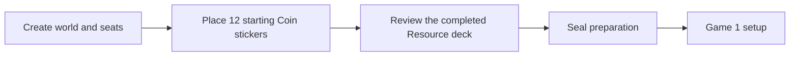
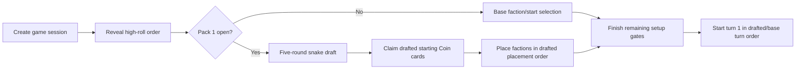

# Prepare the World and Advanced Draft implementation plan

Status: implemented  
Date: 2026-07-16

Implementation note: the shipped flow uses an action-ledger-backed campaign preparation state, an explicit setup-stage state machine, and versioned advanced-draft Coin claims. Legacy campaign imports remain prepared by compatibility normalization; legacy game snapshots retain their historical automatic Coin assignment only while replaying their original action ledgers.

## Outcome

Replace the current form-driven campaign initializer and value-button advanced draft with two authoritative, resumable legacy rituals:

1. **Prepare the World**, once before Game 1: the players physically place all 12 starting Coin stickers onto the 42 Territory cards. The first player to select each faction later chooses its permanent green power during setup.
2. **Advanced Setup Draft**, before every game after Pack 1 has been opened: players draft the physical setup cards in the required snake order, explicitly take any drafted starting Coin cards from the Coin pile into their hand, and then place factions in drafted placement order.

Both flows must work in local hot-seat and LAN play, survive refresh/reconnect, reject out-of-turn or illegal actions in the rules layer, and leave a replayable audit trail.

## Rules baseline

The base rulebook puts **Prepare the World before Game 1**, before normal per-game setup. Each Territory card begins at one resource. Exactly 12 additional Coin stickers are applied to Territory cards, with a starting maximum of three resources on any one card. The rulebook permits one person or a group decision and does not define an order for the group.

For this product, a group decision means one committed sticker per clockwise seat, repeating until all 12 are placed. This is a deterministic collaboration protocol, not a claimed printed rule. There is no dice roll for this ritual; the printed high-roll happens later as part of per-game setup.

Pack 1 permanently replaces the base per-game setup with the five-category advanced draft:

- Faction
- Turn Order
- Starting Placement
- Starting Troops
- Starting Coin cards

The high roller begins. Pick direction reverses after each complete round. Each player must finish with one card from every category. The resulting Turn Order and Starting Placement cards independently govern the game.

## Pre-implementation gaps (closed)

| Area | Current behavior | Required behavior |
| --- | --- | --- |
| Campaign preparation | `WorldPreparation` randomly chooses 12 different card ids in the campaign form. | Players see all 42 cards and commit 12 individual Coin stickers, including the option to place two stickers on one card. |
| Permanence | Card modifications are created as a side effect of `initialCampaign`. | Every placement is a validated campaign-preparation action and is durable immediately. |
| Participation | LAN preparation happens before invitees join; only the host can affect it. | The campaign is created in a preparing state, players join and seat, then all participants take turns. |
| Draft presentation | Categories are value buttons in a modal. | Remaining physical draft cards and each player's drafted tableau are visible. |
| Starting Coin cards | The reducer silently shifts Coin cards into all hands after the final draft pick. | The player who drafts a non-zero Starting Coin card explicitly moves that many Coin cards from the public pile into their private hand before the next draft pick. |
| Setup timing | `phase: "setup"` relies on nullable fields and UI conditionals. The initial high-roll has no visible beat. | An explicit setup stage machine says exactly what is happening and who may act. |
| Reconnect/replay | Game actions replay, but pre-campaign preparation does not exist as a session. | Both campaign preparation and game setup reconstruct exactly after refresh or server restart. |

## Target journeys

### New campaign



Local mode knows its seats when the campaign is created and enters preparation immediately. LAN mode creates an unprepared campaign, allows members to join and claim seats, and lets the host begin preparation once 3–5 players are seated. The participant/order snapshot is then fixed for this ritual.

### Per-game setup



`Claim drafted starting Coin cards` is an interrupt within the draft pick: when a player selects a Starting Coin card worth 1 or 2, the draft does not advance until that player has dragged the granted number of cards from the Coin pile to their hand. A zero card advances immediately.

## Domain model

### Campaign preparation

Add an optional preparation state to `CampaignState`:

```ts
type CampaignPreparationStage =
  | "faction_powers"
  | "resource_stickers"
  | "review"
  | "complete";

interface CampaignPreparationState {
  stage: CampaignPreparationStage;
  participants: { playerId: PlayerId; name: string; seat: number }[];
  actorIndex: number;
  factionPowerChoices: Record<FactionId, string>;
  resourceStickers: {
    stickerId: string; // world-coin-01 ... world-coin-12
    cardId?: CardId;
    slot?: 1 | 2;      // the two sticker slots after the printed Coin
    placedBy?: PlayerId;
    sequence?: number;
  }[];
  sealedAt?: string;
}
```

The 12 sticker identities make the sheet, empty holes, ordering, audit log, and reconnect behavior unambiguous. The persistent rules value remains `CampaignState.board.cardModifications`; sealing preparation derives each modified card's resource count from the committed stickers. Runtime resource calculations continue to read the existing canonical modification structure.

New campaign actions:

```ts
type CampaignPreparationAction =
  | { type: "preparation.chooseFactionPower"; playerId: PlayerId; factionId: FactionId; powerId: string }
  | { type: "preparation.placeResourceSticker"; playerId: PlayerId; stickerId: string; cardId: CardId; slot: 1 | 2 }
  | { type: "preparation.confirmReview"; playerId: PlayerId }
  | { type: "preparation.seal"; playerId: PlayerId };
```

Rules-layer invariants:

- Preparation is legal only while `gameNumber === 0` and before any game session exists.
- Only the current participant may place a sticker.
- A sticker can be placed exactly once.
- Only base Territory cards are valid targets.
- Slot 1 must be filled before slot 2; a Territory card may finish at 1, 2, or 3 resources.
- Exactly 12 stickers and one legal green power per base faction are required before sealing.
- A committed placement is permanent. The UI shows a confirmation affordance before dispatch instead of offering post-commit undo.
- `createGame` rejects an unsealed campaign.

### Game setup and draft

Replace the implicit setup condition tree with an explicit substage:

```ts
type SetupStage =
  | "order_reveal"
  | "advanced_draft"
  | "faction_selection"
  | "mission_setup"
  | "starting_placement"
  | "complete";

interface SetupState {
  stage: SetupStage;
  rolls: Record<PlayerId, number>;
  chooserOrder: PlayerId[];
  nextIdx: number;
}
```

Extend `AdvancedDraftState` with:

```ts
pendingCoinClaim?: {
  playerId: PlayerId;
  total: number;
  remaining: number;
};
```

Add game actions and events:

```ts
{ type: "setup.acknowledgeOrder"; playerId: PlayerId }
{ type: "draft.takeStartingCoin"; playerId: PlayerId; cardId: CardId }

"SetupOrderAcknowledged"
"StartingCoinCardTaken"
```

Refactor draft advancement into one helper. `draft.pick` removes the selected setup card and records it in the player's public tableau. For a non-zero Starting Coin card, it opens `pendingCoinClaim` and does not advance `nextPickIdx`. `draft.takeStartingCoin` validates the claimant and a card in the public Coin pile, removes that card, adds it to the claimant's authoritative hand, decrements `remaining`, and advances the draft only after the claim reaches zero.

When the fifth draft round completes, apply Starting Troops, Turn Order, and Starting Placement. Do not mutate hands in `AdvancedDraftCompleted`. `waitingOn`, filtered network state, simulator policy, and all setup helpers must understand the pending claim.

Setup choices become irreversible after confirmation. Add draft picks and starting-Coin claims to local and server rewind locks so a later player never makes a choice using information that can subsequently disappear.

## Prepare the World screen

Build a dedicated DOM route/screen rather than putting this ritual on the Pixi game table. It uses the existing physical `ResourceCard` visual language but has its own campaign-preparation state and does not introduce a second game-table clock.

### Layout

- Full viewport takeover with a compact actor/progress header.
- All 42 base Territory cards mounted at once in canonical card order.
- Desktop/table layout targets a 7 × 6 responsive grid. Card width is derived from both available width and height so the entire deck fits without page scrolling at supported table resolutions.
- A fixed Coin sheet/tray contains 12 draggable stickers. Removed stickers leave die-cut holes so the remaining inventory is obvious.
- The current player's identity and `Sticker n of 12` stay visible throughout.
- Cards show their printed Coin plus any committed stickers in the exact pip slots where they landed.
- A review stage shows resource-value distribution and highlights every modified card before the world is sealed.
- Narrow screens retain all 42 mounted cards in a zoomable/pannable deck surface. The interaction cannot depend on hover.

### Interaction

- Use pointer events with pointer capture, not browser HTML drag-and-drop, so mouse, touch, and pen behave consistently.
- Drag begins only from the current sticker on the sheet. Legal empty pip slots highlight while dragging.
- Dropping automatically applies the sticker
- On success, animate the sticker from the sheet to the chosen pip using measured DOM rectangles and a transform-only overlay. The server state is the source of truth; reconnect renders the settled result without replaying stale drag state.
- Update sticker sheet and all territories in real time, ask for confirmation after all stickers
- Keyboard equivalent: focus sticker → Enter/Space to pick up → arrow/tab through Territory cards → choose a legal pip → Enter to confirm → Escape to cancel.
- Screen-reader announcements identify current actor, remaining stickers, selected card, resource value before/after, rejection, and turn handoff.

Extend `ResourceCard` through explicit slot/render props rather than duplicating it:

```ts
resourceStickerSlots?: {
  filledBy: Record<1 | 2, string | undefined>;
  activeDropSlot?: 1 | 2;
  onDropSlot?: (slot: 1 | 2) => void;
};
```

Printed resources and later reward upgrades must continue to render correctly outside preparation.

## Advanced draft screen

Replace `AdvancedDraftTakeover`'s value buttons with a full-screen draft table:

- Five labeled rows/areas contain the remaining physical setup cards.
- Every player has a public tableau showing the setup cards already drafted.
- A direction marker shows clockwise or counter-clockwise for the current round, plus round `n of 5` and pick `n of players`.
- The current actor drags or keyboard-selects one legal card into their tableau, then confirms.
- When the selected card is a non-zero Starting Coin card, the draft table exposes the public Coin pile and the current player's private hand target. They drag the required number of actual Coin Resource cards into their hand before control passes.
- Other players and spectators see the Coin pile count, claimant, and public hand-count change, but not private hand identities.
- The completion screen summarizes each player's five-card setup before advancing to starting placement.

Create a small `DraftCard` component for the five setup categories. Do not render setup cards as `ResourceCard`; Starting Coin setup cards grant Resource cards but are not themselves Resource cards.

## Timing contract

The setup reducer becomes the sole authority for progression:

1. A Game 1 session cannot be created until campaign preparation is sealed.
2. The high-roll/order reveal occurs at the start of every game's setup.
3. Advanced draft is present if and only if Pack 1 was already in the campaign snapshot when that game session was created. Opening Pack 1 at the end of a game affects the next game, never the completed one.
4. With Pack 1 closed, base faction/start selection remains available.
5. With Pack 1 open, no faction may be placed until the draft and all pending starting-Coin claims are complete.
6. Starting placement follows the drafted Placement Order; turn 1 follows the drafted Turn Order.
7. Starting Coin cards are already in the correct private hands before faction placement and before turn 1.
8. Mission/Lead-Faction setup is represented as a named setup gate rather than being triggered after `phase` changes. As part of this refactor, verify its exact ordering against the sealed rule source and lock it with a focused test.

## Persistence and networking

### Local

- Increment the local save and campaign schema versions.
- `startLocalCampaign` creates a save with preparation state and no `activeGame`.
- Add `applyLocalPreparationAction`; persist after every committed sticker/power action.
- `createNextLocalGame` is allowed only after preparation is complete.
- Resume routes to preparation, active game, or campaign hub based on durable state.

### LAN/server

- `POST /api/campaigns` creates an unprepared campaign from `worldName` only; remove client-supplied finalized sticker destinations from the normal creation path.
- Campaign summaries expose `preparationStatus`.
- Add a campaign-preparation socket room and `preparation:join`, `preparation:action`, and `preparation:state` messages.
- Snapshot the seated 3–5 participants when the host begins preparation. Seat changes are disabled until it is sealed.
- Serialize actions per campaign, just as game actions are serialized per session.
- Add `campaign_actions(campaign_id, seq, actor_id, kind, payload, created_at)` and transactionally append the action plus updated `campaigns.state`.
- Rebuild/verify preparation from its action ledger on load; broadcast the resulting state to all members.
- `game:create` rejects campaigns whose preparation is not complete.

### Hidden state

- Campaign preparation is entirely public.
- Advanced draft cards and picks are public.
- The Coin pile count is public.
- A player's Resource-card identities remain private. `filterStateFor` exposes only the viewer's hand and other players' counts, including while starting Coin cards are being claimed.

## Compatibility and migration

- Existing campaigns and saves are treated as already prepared. Their current `factionPowerChoices` and `board.cardModifications` remain authoritative; do not invent or replay sticker identities for them.
- New campaigns use the interactive preparation state.
- Keep `InitialCampaignCustomization` only as an explicitly named import/test compatibility path, not the user-facing creation path.
- A migration marks legacy states `preparation: { stage: "complete", ... }` or uses absence plus `gameNumber/existing modifications` as a normalized completed state.
- Replaying existing game ledgers must remain byte-for-byte behaviorally compatible. The new starting-Coin action applies only to newly created advanced-draft sessions; old ledgers still reconstruct through a versioned compatibility reducer or session schema migration.

## Implementation slices

### Slice 1 — Rules model for interactive world preparation

- Add preparation state, actions, reducer, invariants, and seal/finalize derivation.
- Separate `createUnpreparedCampaign` from the compatibility `initialCampaign` importer.
- Unit-test 12 placements, two stickers on one Territory card, max-three enforcement, turn rotation, wrong actor, duplicate sticker, duplicate slot, incomplete sealing, and deferred permanent faction powers.

### Slice 2 — Local Prepare the World experience

- Change the local hub to collect world name and seats without randomizing stickers.
- Add the full-deck screen, Coin sheet, pointer/keyboard placement, confirmation, review, and resume.
- Extend `ResourceCard` with addressable sticker pips.
- Add component, accessibility, reduced-motion, responsive, and local persistence tests.

### Slice 3 — LAN preparation lifecycle

- Add campaign preparation action persistence, socket room, authorization, serialization, reconnect, and lobby gating.
- Allow invitees to join and seat before preparation begins.
- Add two-/three-client tests proving actor enforcement, synchronized placement, refresh recovery, host disconnect recovery, and Game 1 launch gating.

### Slice 4 — Explicit per-game setup stage machine

- Add `SetupStage`, visible order reveal, authoritative progression helpers, and timing guards.
- Preserve base setup behavior while removing UI inference from nullable state.
- Audit Mission/Lead-Faction ordering and encode the result as a setup-stage test.

### Slice 5 — Physical advanced draft and explicit Coin claims

- Build `DraftCard` and the full draft table/tableaux.
- Add `pendingCoinClaim` and `draft.takeStartingCoin`.
- Remove automatic hand assignment from `AdvancedDraftCompleted`.
- Update waiting/hidden-state filtering, local/network dispatch, rewind locks, simulator, scenario drivers, and tests.

### Slice 6 — Presentation, migration, and release hardening

- Add semantic presentation handling or explicit non-visual mappings for new game events.
- Migrate local saves and normalize existing server campaign JSON.
- Add reconnect/replay tests for preparation and draft interruptions.
- Add visual and performance coverage for 42 simultaneous cards, pointer dragging, reduced motion, and supported viewport tiers.
- Update `SPEC.md`, `README.md`, the rulebook audit, campaign fixtures, and progress/backlog records to describe the actual flow rather than an initializer shortcut.

## Acceptance criteria

- A new campaign cannot reach Game 1 until all 12 Coin stickers have been committed and reviewed. Faction powers are chosen by the first player to select each faction during setup.
- The preparation screen visibly mounts all 42 Territory cards and all 12 sticker-sheet positions.
- Players alternate one sticker per clockwise seat; the current actor is enforced in local and LAN modes.
- Players can legally create a three-resource Territory card by placing both available sticker pips on it.
- Refreshing or reconnecting after any of the 12 placements restores the exact sheet holes, card pips, actor, and progress.
- Pack 1 closed: no advanced draft is shown.
- Pack 1 opened during a completed game: advanced draft first appears in the following game.
- Pack 1 already open: every new game begins with the five-category snake draft.
- A player who drafts 1 or 2 Starting Coin cards must explicitly move that many actual Coin cards into their hand before the next pick.
- No automatic post-draft hand assignment remains.
- Placement Order, Turn Order, Starting Troops, Faction, and Starting Coin choices all affect the game independently and match the public draft tableaux.
- Other network viewers never receive another player's private Resource-card identities.
- Existing campaigns, saves, and game ledgers still load and play.

## Verification gates

Each slice must run the repository verification loop from `AGENTS.md`. The final table-facing slice must additionally prove:

- `npm test`
- `npm run lint`
- `npm run validate:content`
- `npm run sim -- 1234 4`
- `npm run validate:presentation-map && npm run test:presentation`
- `npm run test:visual && npm run perf:table && npm run assets:table:report`

The 30-minute soak gate is required only if this work changes the presentation-runtime release or Pixi table runtime; the planned Prepare the World deck surface is DOM-based and should not by itself require that gate.
