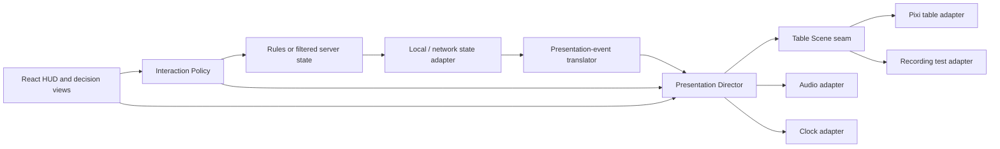

# Risk Legacy — Presentation Runtime Migration Specification

Status: **Proposed**  
Target: `apps/web`, with supporting event and map-manifest changes  
Decision owner: campaign-table maintainers  
Last updated: 2026-07-12

This specification defines the migration from the current SVG board plus cosmetic PixiJS overlay to a studio-quality game-table presentation runtime. It covers architecture, state sequencing, input, one-troop and three-troop pieces, art production, motion, audio, assets, testing, rollout, and deletion of the legacy renderer.

The migration is intentionally presentation-only. The deterministic rules engine, campaign rules, server authority, hidden-state filtering, action ledger, and Socket.IO protocol remain authoritative.

---

## 1. Executive decision

Keep:

- `packages/rules` as the deterministic authority.
- `apps/server` as the network authority.
- React and Tailwind for the hub, cards, HUD, decision surfaces, campaign administration, and accessibility mirrors.
- The canonical map manifest, territory ids, adjacency, board coordinate system, and production board artwork.
- The existing `game:join`, `game:action`, and filtered `game:state` protocol.

Replace:

- The React SVG board-piece implementation in `apps/web/src/game/Board.tsx`.
- The shallow cosmetic seam in `apps/web/src/game/EffectsLayer.tsx`.
- Independent CSS timers for game-table events.
- Immediate visual settlement on every authoritative `GameState` replacement.

Introduce:

- A deep **Presentation Director** module that sequences authoritative state transitions into visual beats.
- A **Table Scene** seam with a production PixiJS adapter and a recording test adapter.
- A typed presentation-event translator, followed by a typed rules-event union.
- A map-presentation manifest containing piece slots, marker slots, camera focus, and crowding metadata.
- A production art pipeline for faction-specific one-troop and three-troop pieces.
- A synchronized camera, particle, sound, and optional haptic grammar.

The desired result is not “more effects.” The desired result is a table that preserves causality: players see what moved, what was lost, what changed ownership, and why, in the correct order.

---

## 2. Product goals

### 2.1 Required outcomes

1. Armies read as physical one-troop and three-troop pieces rather than numeric badges.
2. Recruitment, expansion, maneuver, battle, conquest, scars, cities, Red Stars, missiles, unlocks, and victory have distinct visual and audio language.
3. Authoritative state never appears to teleport ahead of its explanation.
4. Local, networked, spectator, reconnect, and replay views use the same presentation implementation.
5. The table remains readable at 1280×720 and usable at 390×844 without browser zoom.
6. Reduced-motion users receive the same information with minimized movement.
7. Keyboard and assistive-technology access survives the move away from interactive SVG paths.
8. The production scene meets explicit frame-time, memory, and asset-size budgets.

### 2.2 Art-direction outcomes

The table should feel:

- **Tactile:** pieces have weight, contact shadows, material, and impact.
- **Campaign-worn:** scars, stickers, signatures, cities, and opened content visibly accumulate.
- **Strategic, not arcade:** movement is readable and restrained; particles support information instead of obscuring it.
- **Premium tabletop:** closer to a photographed deluxe board-game adaptation than a flat dashboard.
- **Faction-authored:** every faction remains identifiable without relying on hue alone.

### 2.3 Non-goals

- No rules redesign.
- No runtime 3D world, free-orbit camera, or physics simulation.
- No Unity, Phaser, or Three.js rewrite.
- No optimistic network rules state.
- No cinematic that prevents a player from taking a required action for more than the timing budgets in this specification.
- No reproduction of commercial artwork beyond what is appropriate for this private, non-commercial table; new piece art should be original-but-faithful rather than traced scans.

---

## 3. Current-state diagnosis

### 3.1 Rendering is split across three implementations

The current table combines:

1. A raw production SVG inserted into the DOM and imperatively restyled.
2. A React-owned SVG overlay for troop counters, HQs, cities, scars, and fortifications.
3. A PixiJS overlay that draws only an attack line and conquest ring.

This prevents the board, pieces, camera, lighting, and effects from sharing a scene graph. State changes settle immediately in React; cosmetic effects then react to already-settled state.

### 3.2 The event interface is too loose for presentation

`GameEvent.type` is a string and `data` is an arbitrary record. Some events contain enough spatial information for animation; others require the web app to infer context from the current state. That inference becomes unreliable once combat is cleared, a reconnect skips intermediate snapshots, or multiple events arrive in one state update.

### 3.3 `GameScreen` mixes unrelated knowledge

`GameScreen.tsx` currently owns table layout, interaction policy, action dispatch, legal highlights, target selection, phase timers, important moments, host decisions, and most overlay routing. Splitting it into many pass-through files would fail the deletion test: the same complexity would simply reappear across callers. The migration instead introduces a small number of deep modules with narrow interfaces.

### 3.4 Pixi is not exercised by tests

The jsdom test environment deliberately disables WebGL/WebGPU and accepts an empty effects layer. Existing tests verify rules reachability and DOM state well, but not production rendering, timing, texture loading, camera behavior, or animation order.

### 3.5 Saved-state compatibility is a prerequisite

A stale local campaign can currently reach fields that did not exist when the save was written. A richer presentation runtime will add more versioned client state and must not turn an old campaign into a blank screen. Saved campaign and active-game snapshots require explicit schema versions, migrations, validation, and an error fallback before the renderer becomes the default.

---

## 4. Fixed contracts and revised contracts

### 4.1 Contracts that remain fixed

- Board coordinate system: `0 0 749.819 519.068`.
- Canonical territory ids and adjacency.
- Production board-art source: `packages/map/assets/board.svg`.
- Rules entry: `applyAction(state, action) -> nextState`.
- Socket events: `game:join`, `game:action`, `game:state`.
- Server-side hidden-state filtering.
- Append-only action ledger and deterministic replay.

### 4.2 Contract deliberately revised

The `EffectsLayer(gs)` seam is retired. It has one production adapter and exposes almost no leverage: it can draw after-the-fact decoration but cannot control presented state, pieces, camera, audio, or commit timing.

The replacement **Table Presentation** seam has two adapters from its first production slice:

- `PixiTableSceneAdapter` — renders the live game table.
- `RecordingTableSceneAdapter` — records semantic scene commands for deterministic tests.

This is a real seam because behavior varies across two adapters.

### 4.3 Socket compatibility

No protocol rename is required. `game:state` continues to deliver filtered `GameState`. The network wrapper retains the previous snapshot in a ref and submits `{ previous, next, newEvents }` to the Presentation Director before updating the settled React view.

An optional `stateRevision` may be added to the envelope for diagnosis and gap detection. It must be additive and may not be required by old clients during the migration window.

---

## 5. Presentation vocabulary

These terms are normative.

**Authoritative State**  
The latest valid filtered `GameState` received from the local rules adapter or server.

**Presented State**  
The state currently represented by the table scene. It may temporarily lag Authoritative State while a visual sequence explains a transition.

**State Transition**  
One ordered change from a previous authoritative snapshot to a next authoritative snapshot, including all newly emitted events.

**Presentation Event**  
A typed, viewer-safe semantic fact used by the Presentation Director. It contains all spatial and causal data needed to present the fact without consulting mutable combat state.

**Visual Beat**  
One meaningful visual/audio step, such as moving an army, removing casualties, changing ownership, placing a scar, or focusing the camera.

**Visual Sequence**  
An ordered or parallel group of Visual Beats derived from one State Transition.

**Commit Point**  
The moment a portion of Presented State advances to match Authoritative State. A sequence may have multiple commit points.

**Presentation Director**  
The deep module that accepts State Transitions, plans Visual Sequences, controls time, coordinates scene/audio/camera adapters, supports skip/reduced-motion/catch-up, and advances Presented State.

**Table Scene**  
The retained scene containing board art, territory treatments, pieces, permanent marks, labels, routes, and effects.

**Interaction Policy**  
The deep module that decides what a territory means under the current phase, viewer, selection, and pending decision.

**Army Stack**  
The visual representation of a territory’s troop count using one-troop and three-troop pieces plus an overflow treatment when necessary.

---

## 6. Target module map



### 6.1 Dependency direction

- `packages/rules` must not import presentation code.
- `packages/map` may expose presentation geometry but must not import Pixi or React.
- Presentation planning may import rules and map types.
- Pixi implementation stays inside `apps/web`.
- React view modules may call the Presentation Director and Interaction Policy interfaces, but may not reach into the Pixi scene graph.
- Audio, clock, and table adapters are injected into the Presentation Director.

---

## 7. Module interfaces

The type sketches below are intended contracts. Names may change during implementation, but invariants and ordering requirements may not.

### 7.1 State Transition input

Proposed file: `apps/web/src/game/presentation/types.ts`

```ts
export type TransitionSource = "local" | "network" | "reconnect" | "replay";

export interface StateTransition {
  previous: GameState;
  next: GameState;
  events: readonly PresentationEvent[];
  source: TransitionSource;
  receivedAt: number;
}
```

Invariants:

- `next.eventSeq >= previous.eventSeq`.
- `events` contains only events with `previous.eventSeq < seq <= next.eventSeq`.
- Events are strictly ordered by `seq`.
- Events are already filtered for the current viewer.
- `reconnect` may contain no presentable intermediate events; it settles immediately after a short resync treatment.

Error modes:

- A decreasing event sequence is rejected and forces a hard resync.
- A gap that cannot be explained from `next.log` forces immediate settlement rather than fabricated animation.
- Unknown Presentation Events log a diagnostic and settle the relevant state without blocking play.

### 7.2 Presentation Director interface

Proposed files: `apps/web/src/game/presentation/PresentationDirector.ts` and `createPresentationDirector.ts`.

```ts
export interface PresentationDirector {
  mount(initial: GameState): void;
  submit(transition: StateTransition): void;
  setInteractionState(state: InteractionPresentationState): void;
  setMotionPreference(preference: "full" | "reduced" | "instant"): void;
  skipCurrentSequence(): void;
  settleImmediately(state: GameState, reason: SettleReason): void;
  subscribe(listener: (snapshot: PresentationSnapshot) => void): () => void;
  dispose(): void;
}
```

Interface invariants:

- `mount` occurs once before `submit`.
- `submit` never mutates rules state.
- At most one Visual Sequence is actively writing to the scene.
- Later State Transitions queue in event order.
- `skipCurrentSequence` applies every pending commit point before starting the next sequence.
- `dispose` cancels clocks, releases audio handles, clears queued transitions, and destroys the scene adapter.

The implementation hides:

- Beat planning and choreography.
- Duration scaling.
- Scene-command batching.
- Piece interpolation and pooling.
- Audio synchronization.
- Camera ownership.
- Catch-up and skip behavior.
- Presented-State partial commits.

### 7.3 Table Scene seam

Proposed file: `apps/web/src/game/presentation/TableScene.ts`.

```ts
export interface TableScene {
  mount(host: HTMLElement, initial: TableRenderModel): Promise<void>;
  apply(model: TableRenderModel): void;
  execute(command: SceneCommand, signal: AbortSignal): Promise<void>;
  setInteraction(model: TableInteractionModel): void;
  resize(viewport: TableViewport): void;
  captureDiagnostics(): Promise<TableSceneDiagnostics>;
  dispose(): void;
}
```

`apply` is an immediate, idempotent settlement operation. `execute` is temporal and resolves only after the semantic command completes or is aborted. Callers do not manipulate sprites, containers, textures, or filters directly.

The recording adapter must record `apply`, `execute`, interaction, resize, and abort behavior in a stable semantic format. Tests assert against those records rather than Pixi implementation details.

### 7.4 Clock seam

Adapters:

- `RafPresentationClock` for production.
- `ManualPresentationClock` for deterministic tests.

The clock controls all table animation. Game-table code may not call `Date.now`, `performance.now`, `requestAnimationFrame`, or `setTimeout` directly outside the production clock adapter.

### 7.5 Audio seam

Adapters:

- `WebAudioTableAudioAdapter` for production.
- `RecordingTableAudioAdapter` for tests.
- `SilentTableAudioAdapter` for unsupported environments.

The interface accepts semantic cues such as `piece.place`, `battle.impact`, and `scar.apply`, not file paths. Asset selection, pooling, concurrency, and gain are hidden by the implementation.

### 7.6 Interaction Policy interface

Proposed files: `apps/web/src/game/interaction/InteractionPolicy.ts` and `deriveInteractionModel.ts`.

```ts
export interface InteractionModel {
  mode: InteractionMode;
  territories: Readonly<Record<TerritoryId, TerritoryIntent>>;
  selectedTerritoryId?: TerritoryId;
  instruction: string;
}

export type InteractionResult =
  | { kind: "selection"; selection: LocalTableSelection }
  | { kind: "action"; action: Action }
  | { kind: "explanation"; message: string }
  | { kind: "none" };

export interface InteractionPolicy {
  derive(input: InteractionInput): InteractionModel;
  activate(territoryId: TerritoryId, input: InteractionInput): InteractionResult;
}
```

This module replaces the duplicated knowledge currently embedded in highlight derivation, territory-click branches, inspector explanations, and future Pixi hit handlers. Both the Pixi pointer adapter and accessible DOM adapter call the same interface.

---

## 8. Presentation events

### 8.1 Migration strategy

Do not convert every rules event in one change.

Phase 1 introduces `translatePresentationEvents(previous, next, gameEvents)` in the web app. It converts the current loose ledger into a discriminated `PresentationEvent` union and fills missing data from immutable previous/next snapshots.

Phase 2 moves the discriminated union into `packages/rules/src/events.ts` and makes `emit` generic, so incorrect payloads fail type checking at the source.

### 8.2 Minimum Presentation Event union

```ts
export type PresentationEvent =
  | { type: "troops.placed"; seq: number; playerId: string; territoryId: string; count: number }
  | { type: "territory.expanded"; seq: number; playerId: string; from: string; to: string; moved: number; losses: number }
  | { type: "battle.declared"; seq: number; attackerId: string; defenderId: string; from: string; to: string }
  | { type: "dice.rolled"; seq: number; from: string; to: string; attack: number[]; defense: number[] }
  | { type: "battle.resolved"; seq: number; from: string; to: string; attackerLosses: number; defenderLosses: number }
  | { type: "territory.conquered"; seq: number; playerId: string; from: string; to: string; moved: number; capturedHqFactionId?: string }
  | { type: "army.maneuvered"; seq: number; playerId: string; from: string; to: string; count: number }
  | { type: "scar.applied"; seq: number; playerId: string; territoryId: string; scarId: string }
  | { type: "scar.attrition"; seq: number; playerId: string; territoryId: string; delta: number }
  | { type: "city.founded"; seq: number; playerId: string; territoryId: string; cityType: string; name: string }
  | { type: "city.fortified"; seq: number; playerId: string; territoryId: string }
  | { type: "hq.moved"; seq: number; playerId: string; from: string; to: string; factionId: string }
  | { type: "redStar.gained"; seq: number; playerId: string; source: string; territoryId?: string }
  | { type: "missile.committed"; seq: number; playerId: string; from: string; to: string; side: "att" | "def" }
  | { type: "module.revealed"; seq: number; moduleId: string; timing: "mid_game" | "end_game" }
  | { type: "game.won"; seq: number; playerId: string; reason: string };
```

Every spatial event must carry its source and target explicitly. Presentation code may not read `next.combat` to reconstruct past movement.

### 8.3 Viewer safety

- Hidden card identities and scar hands never enter Presentation Events for unauthorized viewers.
- Spectators receive only public cues.
- A translated event must not infer hidden identity from an unfiltered snapshot.
- Recording tests must include the existing hidden-state leak assertions.

---

## 9. State sequencing and commit policy

### 9.1 General sequence

For every action-generated State Transition:

1. Validate event order and detect gaps.
2. Translate events.
3. Plan a Visual Sequence.
4. Preserve the current Presented State.
5. Run camera anticipation when required.
6. Execute movement, effect, audio, and overlay beats.
7. Apply commit points as causal changes become visible.
8. Settle the complete next snapshot.
9. Publish idle state and accept interaction for the next decision.

### 9.2 Commit examples

**Recruitment**

- Before beat: old troop count remains.
- Piece-place beat: new pieces arrive.
- Commit: troop count advances when the pieces contact the board.

**Battle casualties**

- Dice result may appear before troop removal.
- Casualty pieces lift/fall/fade from the old Army Stack.
- Commit: troop counts advance after casualty removal.

**Conquest**

- Defender reaches zero visually.
- Attacking pieces travel from source to target.
- Commit source troop count as pieces depart.
- Commit target ownership and count as pieces land.
- HQ capture and Red Star beats follow target ownership.

### 9.3 Queue and catch-up policy

- Normal maximum queued transitions: 8.
- If the queue exceeds 8 or represents more than 12 seconds of full-motion choreography, enter catch-up mode.
- Catch-up mode scales ordinary durations to 35%, removes decorative holds, and preserves causal ordering.
- If the queue exceeds 20, settle to the newest authoritative snapshot with a 200 ms resync treatment.
- Spectators may default to 60% timing during high action volume.
- A new required decision may not become actionable until the scene reaches the commit point that explains it.

### 9.4 Reconnect and rewind

- Initial join: mount directly at the received snapshot; do not replay historical ledger events.
- Reconnect with a contiguous event range: animate only events after the last presented sequence.
- Reconnect with a gap: settle immediately and show a non-blocking “table resynced” cue.
- Rewind/reset: abort the active sequence, silence transient audio, clear queued transitions, apply the rewound snapshot, and run a 180 ms reverse-page/resync treatment. Do not reverse individual battle animations.

### 9.5 Skip and reduced motion

- Full motion: all informative and decorative beats.
- Reduced motion: no camera translation, shake, large scale pulses, parallax, or long particle trails; informative changes crossfade in 80–120 ms.
- Instant: apply commit points immediately, retain only status text and essential focus changes.
- “Skip” is always available for sequences longer than 900 ms and may be triggered by repeated pointer/keyboard activation.

---

## 10. Table Scene specification

### 10.1 Coordinate system

- World coordinates exactly match the board viewBox: `749.819 × 519.068`.
- All piece slots, marker slots, route points, and camera focus points live in world coordinates.
- Renderer resolution uses device pixel ratio, capped at 2 on high-density displays unless the performance governor lowers it.
- The scene uses `roundPixels` only for bitmap text and small HUD-aligned labels; pieces retain subpixel movement.

### 10.2 Layer order

From back to front:

1. Table backdrop and vignette.
2. Board artwork.
3. Territory owner washes and legal-target masks.
4. Printed and custom connection routes.
5. Permanent board marks: scars, continent names, bonus marks, signatures.
6. Cities, fortifications, HQs, Red Stars, and special structures.
7. Army Stacks.
8. Selection rings, path previews, and hover treatments.
9. Movement and battle effects.
10. World-space labels that must track camera motion.

React-owned overlays, cards, decision views, and modal surfaces remain above the canvas in DOM space.

### 10.3 Board artwork

The existing SVG remains the source artwork during migration. The production Pixi adapter loads it as a static texture at sufficient resolution for the maximum supported zoom.

Territory interaction and owner treatment do not depend on raster pixels. A build step converts canonical territory paths into hit geometry and masks. The old DOM paths remain only in the legacy renderer and test fixtures until cutover.

### 10.4 Camera

- Default camera fits the full board with 2–4% safe margin.
- Maximum manual zoom on all viewports: 3.2×.
- Pointer wheel/pinch zoom centers on the pointer midpoint.
- Drag pan has 8% elastic overscroll and snaps back inside board bounds.
- Selecting a territory may nudge focus but may not steal manual camera control.
- Battle focus frames source and target plus 12% margin.
- Automatic camera travel lasts 260–480 ms based on distance.
- Camera shake is limited to 3 world pixels for ordinary battle and 6 for nuclear resolution.
- Camera motion is disabled under reduced motion.

### 10.5 Interaction states

Never communicate meaning through color alone.

| Intent | Color role | Shape/motion role |
|---|---|---|
| Hover/inspect | warm white | thin breathing outline |
| Selected source | signal gold | double ring + raised Army Stack |
| Legal recruit/start | green-teal | inward chevrons |
| Legal attack | danger red | pointed outward ticks |
| Legal maneuver | cool blue | dotted route pulse |
| Illegal | muted graphite | short denied shake only after activation |
| Spectator focus | neutral white | thin static outline |

Ownership is shown by the Army Stack and a low-opacity territory wash. Interaction states always override ownership treatments.

---

## 11. Map-presentation manifest

The current single anchor per territory is insufficient for physical pieces and permanent marks.

Add `packages/map/data/presentation.json`:

```ts
export interface TerritoryPresentationDef {
  territoryId: TerritoryId;
  cameraFocus: [number, number];
  pieceSlots: Array<[number, number, number]>; // x, y, scale
  overflowSlot: [number, number];
  hqSlot: [number, number];
  citySlot: [number, number];
  scarSlot: [number, number];
  fortificationSlot: [number, number];
  labelAvoidance: Array<[number, number, number, number]>;
  preferredRoutePorts: Partial<Record<TerritoryId, [number, number]>>;
}
```

Requirements:

- Minimum 5 piece slots for every normal territory.
- Minimum 7 for geographically large territories where space permits.
- Slots may overlap the territory path slightly but may not cover its printed name at default zoom.
- Marker slots may not collide with the first three piece slots.
- Route ports begin inside the source mask and terminate inside the target mask.
- Alien Island uses the same definition instead of a hard-coded coordinate in web code.
- A development-only authoring overlay displays slots, masks, labels, and route ports over the board.
- Manifest validation fails on missing territories, out-of-viewBox points, duplicate ids, or insufficient slots.

---

## 12. Army Stack and piece rules

### 12.1 Denominations

Every faction receives:

- A **one-troop piece**: compact infantry-scale silhouette.
- A **three-troop piece**: visibly heavier, taller, or mounted silhouette.

The denominations must be distinguishable at 24 CSS pixels in grayscale and at a glance. The three-troop piece may not be a scaled-up one-troop piece.

### 12.2 Composition algorithm

For troop count `n`:

```ts
threePieceCount = Math.floor(n / 3);
onePieceCount = n % 3;
```

Display policy:

- Counts 1–12: show the exact one-/three-piece composition.
- Counts 13–18: show up to five three-pieces plus exact one-piece remainder.
- Counts above 18: show five three-pieces, the exact one-piece remainder, and a reserve tab containing the unrepresented troop count.
- The reserve tab uses `+N`, not a replacement total, so the visible pieces still carry denomination meaning.
- Inspector and accessible labels always state the exact troop total.

Examples:

| Troops | Visible treatment |
|---:|---|
| 1 | one 1-piece |
| 3 | one 3-piece |
| 5 | one 3-piece + two 1-pieces |
| 8 | two 3-pieces + two 1-pieces |
| 14 | four 3-pieces + two 1-pieces |
| 23 | five 3-pieces + two 1-pieces + `+6` reserve tab |

### 12.3 Placement

- Army Stack positions derive only from the presentation manifest and faction id; no unseeded randomness.
- A territory uses a stable variant seed derived from `gameId + territoryId` so pieces do not shuffle between renders.
- Larger pieces occupy rear slots; smaller pieces occupy front slots.
- Selected stacks rise 2–3 world pixels and gain a contact-shadow spread.
- Stack depth sorts by world-space `y`, then denomination, then stable piece id.
- Pieces must not cover HQ, city, scar, fortification, or label slots at default camera fit.

### 12.4 Piece identity during transitions

The Presentation Director assigns ephemeral visual ids to pieces so a movement animates existing sprites instead of destroying one stack and creating another.

- Recruitment creates new ids at an off-board reserve origin.
- Expansion and maneuver transfer ids from source to target.
- Casualties retire ids from the front-most eligible pieces, preferring one-pieces when denomination conversion can preserve the exact remaining count.
- When exact denomination conversion is required, one three-piece may split into three one-pieces or three one-pieces may consolidate into one three-piece during the settlement beat.
- Conversions use a 140–220 ms crossfade/scale treatment and never imply additional troop gain or loss.

---

## 13. Piece art direction

### 13.1 Core look

Art direction: **painted campaign miniatures photographed on a battle-worn command table**.

Pieces should not look like:

- Flat vector icons.
- Glossy mobile-game gems.
- Realistic modern soldiers.
- Detailed miniatures whose silhouettes collapse at board scale.
- Plastic toys lit independently from the board.

Pieces should have:

- Simplified heroic proportions.
- Strong denomination silhouettes.
- Matte painted bodies with restrained edge wear.
- One authored faction material and two accent materials.
- A warm upper-left key light matching the board chrome.
- A cool, subtle lower-right rim to separate pieces from dark territories.
- Separate soft contact shadows.
- Slightly exaggerated bases and weapons for readability.

### 13.2 Camera and source production

Recommended production pipeline:

1. Model pieces in Blender at high detail.
2. Author one-troop and three-troop pieces for each faction from shared base proportions.
3. Render orthographically at 38° downward elevation and 15° clockwise azimuth.
4. Use the same camera, light rig, ground plane, and scale across every piece.
5. Render three subtle yaw variants per denomination: `-8°`, `0°`, `+8°`.
6. Export transparent color and shadow passes separately.
7. Downsample with high-quality alpha coverage.
8. Pack production textures into faction atlases.

Source deliverables per piece:

- Blender source file or equivalent editable source.
- 1024×1024 lossless master color render.
- 1024×1024 lossless shadow render.
- 512×512 and 256×256 production exports.
- Pivot metadata at base center.
- Bounding box and authored visual height.
- Thumbnail sheet at expected 18, 24, 32, and 48 CSS pixel display sizes.

Production acceptance:

- Silhouette is recognizable at 24 pixels.
- One- and three-troop pieces remain distinguishable in grayscale.
- No alpha fringe on light or dark territory backgrounds.
- Contact shadow reads at default board fit without becoming a black halo.
- The three yaw variants look like the same sculpt, not different denominations.

### 13.3 Faction art matrix

Canonical faction colors remain sourced from the content pack. Art may add material variation but may not shift the primary hue enough to confuse ownership.

| Faction | Primary | Material language | One-troop direction | Three-troop direction | Silhouette cue |
|---|---|---|---|---|---|
| Die Mechaniker | `#e0a93c` | ochre enamel, dark steel, brass fasteners | compact engineer infantry with squared pack and tool-rifle | heavy riveted field automaton or armored gunner | square shoulders and rectangular base details |
| Enclave of the Bear | `#b3403a` | crimson cloth, worn leather, bone/ivory insignia | broad frontier infantry with bear-pelt shoulder mass | heavy mounted or shielded war leader | wide hexagonal upper silhouette |
| Imperial Balkania | `#7e57c2` | violet lacquer, ceremonial steel, pale trim | upright disciplined line infantry | bannered heavy guard or compact artillery rider | tall diamond/standard silhouette |
| Khan Industries | `#3f8cff` | cobalt industrial paint, black polymer, white corporate marks | clean modular trooper with rounded equipment | corporate assault platform or armored cavalry | circular machinery and precise symmetry |
| Saharan Republic | `#43a06b` | green enamel, sand cloth, bronze accents | light mobile infantry with trailing scarf | fast mounted/heavy raider | forward lean and shield-shaped negative space |
| Mutants | `#9aa83f` | sickly olive flesh/armor, oxidized scrap, hot mutation accent | asymmetric survivor with oversized limb or growth | fused brute or scrap-armored abomination | burst-like asymmetry |
| Aliens | `#6dced1` | cyan ceramic shell, dark void joints, pearlescent edge | narrow tripod/biped drone | floating heavy invader or shielded walker | teardrop head and elevated mass |

The base factions should feel like improved interpretations of the physical one-/three-troop vocabulary. Mutants and Aliens may break that vocabulary more aggressively while preserving the same denomination readability.

### 13.4 Permanent marks

- HQs: faction-authored physical pieces, taller than three-troop pieces, with emblem readable at 32 pixels.
- Minor City: small cream sticker/building cluster, population one.
- Major City: larger gold-edged sticker/building cluster, population two.
- World Capital: unique five-population landmark with subdued animated beacon.
- Fortification: a physical wall/rampart ring that wraps the city rather than a floating `F` badge.
- Scars: visibly adhered circular stickers with slight rotation, lifted edge, and printed wear.
- Ruins: replace the city treatment with broken dark structures and ash stain.
- Red Stars and missiles: physical tokens with metallic/specular accents, not text counters when shown on the table.

### 13.5 Board and chrome relationship

The board remains lower contrast than active pieces. Dynamic territory ownership should use a 12–20% translucent wash, never opaque recoloring. The existing war-room chrome remains, but new texture density should be concentrated on the table rather than adding more noise to every panel.

Pieces receive the sharpest edges and brightest local highlights. Cards and modal surfaces may be rich, but should dim when the camera is explaining a board event.

---

## 14. Animation grammar

### 14.1 Principles

- Information before spectacle.
- One major focal event at a time.
- Movement begins with anticipation and ends with a readable settle.
- Ownership changes only after pieces physically reach the destination.
- No effect may obscure troop totals or required targets for more than 250 ms.
- Decorative particles are capped and pooled.
- Every animation has a reduced-motion equivalent.

### 14.2 Timing table

| Event | Full-motion timing | Required beats |
|---|---:|---|
| Hover | 90–130 ms | outline in, 1 px lift |
| Select source | 140–180 ms | ring, stack lift, route preview |
| Recruit placement | 280–420 ms | reserve arc/drop, contact squash, count commit |
| Expand movement | 420–700 ms | path preview, grouped travel, resistance loss, settle |
| Maneuver | 450–750 ms | calm grouped travel, no impact flash, settle |
| Attack anticipation | 160–220 ms | camera frame, source compression, target brace |
| Dice roll | 520–720 ms | tumble, result lock, modifier treatment |
| Battle impact | 100–160 ms | directional flash, restrained shake, sound cue |
| Casualty removal | 260–420 ms | affected pieces lift/fall/fade, count commit |
| Conquest transfer | 550–900 ms | route travel, ownership wash, target settle |
| Scar placement | 650–900 ms | peel, hover, slap, edge settle |
| City founding | 700–1000 ms | target glow, sticker/building place, name write |
| Red Star gain | 600–850 ms | token lift from source, arc to HUD, HUD impact |
| Phase transition | 350–700 ms | non-blocking strip movement; no 2.6 s full-screen hold |
| Module reveal | 1.8–3.5 s | dim table, envelope/reveal ritual, explicit skip |
| Victory | 2.5–5 s | board pullback, faction focus, signature/reward handoff |

### 14.3 Battle sequence

Battle is the reference-quality vertical slice.

1. Source selection raises the attacking Army Stack.
2. Legal target selection draws a directional route and target brace.
3. Declaration focuses the camera on both territories.
4. Attacker pieces compress 3–5% toward the source center.
5. Dice roll in the React combat view and table lighting dips slightly.
6. Missile modifiers create a fast token streak to the affected die, not an explosion on the board.
7. On resolution, a directional impact travels from source to target.
8. Attacker and defender casualties leave their respective stacks in comparison order.
9. If defenders remain, both stacks settle and camera control returns.
10. If conquered, surviving attacker pieces travel to the target, ownership wash changes, HQ capture resolves, and Red Star presentation follows.

The current combat decision view remains React-owned. It publishes semantic cues to the Presentation Director instead of owning independent dice and emblem timers.

### 14.4 Particle budgets

- Ordinary placement: maximum 8 particles.
- Battle impact: maximum 24.
- Conquest: maximum 32.
- Nuclear resolution: maximum 120 with adaptive reduction.
- No persistent emitter when the table is idle.
- Total active particles are capped at 180 desktop and 90 mobile.

---

## 15. Audio and haptic direction

### 15.1 Audio identity

Audio should sound like a premium physical table interpreted through a restrained military command room:

- Painted pieces touching board stock.
- Dice on a felt-lined tray.
- Paper, stickers, envelopes, pencils, and card stock.
- Low mechanical accents for faction powers and missiles.
- No realistic gunfire, screams, or constant battlefield ambience.
- No spoken announcer.

### 15.2 Semantic cue catalog

| Cue | Direction |
|---|---|
| `ui.hover` | nearly inaudible dry tick |
| `ui.confirm` | short weighted switch/click |
| `piece.pickup` | light resin scrape |
| `piece.place.one` | single painted-piece tap |
| `piece.place.three` | lower, heavier tap |
| `piece.move` | restrained grouped board movement |
| `dice.tumble` | short felt-tray tumble |
| `dice.lock` | crisp result click |
| `battle.impact` | low table thump plus faction accent |
| `piece.casualty` | brief lift/drop; no vocalization |
| `territory.conquered` | low tonal resolve and token settle |
| `scar.peel` | adhesive peel |
| `scar.slap` | paper/sticker contact |
| `redStar.gained` | metallic token ring, short and warm |
| `missile.commit` | mechanical latch and rising charge |
| `module.reveal` | paper tear, seal break, low tonal bed |
| `game.victory` | faction-colored musical sting under table sounds |

### 15.3 Mixing rules

- Master, table, UI, and music gain groups.
- User-visible master mute and volume control.
- Default master gain conservative enough for laptop speakers.
- Maximum 4 simultaneous ordinary piece-placement sounds; further placements use grouped samples.
- Battle impact sidechains decorative ambience by 3–5 dB for 250 ms.
- Browser audio starts only after user interaction.
- Losing focus suspends or fades audio; refocus does not replay missed cues.

### 15.4 Haptics

Where supported and user-enabled:

- Confirm: 8–12 ms.
- Three-piece placement: 15 ms.
- Battle impact: 20–30 ms.
- Invalid activation: two 8 ms pulses separated by 40 ms.
- No haptics under reduced motion unless independently enabled.

---

## 16. Asset pipeline

### 16.1 Directory layout

```text
apps/web/src/assets/table/
  catalog.ts
  board/
  pieces/
    die_mechaniker/
    enclave_of_the_bear/
    imperial_balkania/
    khan_industries/
    saharan_republic/
    mutants/
    aliens/
  structures/
  marks/
  particles/
  audio/
  atlases/
art-source/
  blender/
  audio/
  export-presets/
```

If editable art source is too large for the repository, store it in the project’s designated binary-art location and keep checksums plus export instructions in `art-source/README.md`.

### 16.2 Pixi asset bundles

Bundles:

- `table-core`: board texture, neutral effects, common structures, bitmap fonts.
- `faction-<id>`: the current game’s selected faction piece atlases and HQ.
- `module-<id>`: Mutants, Aliens, special marks, and reveal assets.
- `table-audio-core`: common table and UI audio.
- `table-audio-module-<id>`: module-specific reveal and event cues.

Loading policy:

- Hub does not load Pixi or table assets.
- Entering a game lazy-loads the presentation runtime.
- `table-core` and seated factions block table reveal behind a progress treatment.
- Locked module assets may preload in the background only after the base table becomes interactive.
- Do not download unopened-content art in a way that reveals filenames or imagery to players before unlock.

### 16.3 Formats and budgets

- Piece color: atlas-friendly WebP/AVIF where decoding support and alpha quality pass visual QA; PNG fallback where needed.
- GPU-heavy large textures: evaluate KTX2/Basis after the initial Pixi scene is stable.
- Audio: WebM/Opus plus compatible fallback.
- Board texture: 2048–3072 px long edge based on visual QA; avoid a 4K default if maximum zoom does not benefit.
- Bitmap font atlas for world-space numeric labels.

Initial transfer budgets, compressed:

| Bundle | Budget |
|---|---:|
| Table runtime JavaScript | ≤ 650 KB gzip, excluding already-shared React code |
| `table-core` visual assets | ≤ 3.0 MB |
| Each base faction atlas | ≤ 700 KB |
| Each sealed faction atlas | ≤ 900 KB |
| Core audio | ≤ 1.5 MB |
| Any one module visual/audio bundle | ≤ 2.5 MB |

The current faction-card scans should be converted and lazy-loaded separately; they must not prevent the table from becoming interactive.

---

## 17. React integration

### 17.1 New table host

Replace the current board/effects pairing with a single React host module:

```tsx
<GameTable
  authoritativeState={gs}
  viewerId={viewer}
  interaction={interactionModel}
  onTerritoryActivate={handleTerritoryActivate}
  onPresentationStateChange={setPresentationSnapshot}
/>
```

`GameTable` mounts and disposes the Presentation Director. It does not contain game-rule branching.

### 17.2 React-owned surfaces

Remain in React:

- Hub and LAN flow.
- Header and phase track.
- Setup and advanced-draft takeovers.
- Combat decisions and dice detail.
- Hand, sideboard, resource cards, scars, and reward choices.
- Inspector and battle ledger.
- Accessibility mirror.
- Settings, volume, motion, and renderer diagnostics.

### 17.3 Presentation snapshot

React may subscribe to coarse presentation state:

```ts
interface PresentationSnapshot {
  status: "loading" | "idle" | "presenting" | "catching_up" | "resyncing" | "failed";
  activeEventSeq?: number;
  queuedTransitions: number;
  canSkip: boolean;
  inputBlocked: boolean;
  failure?: string;
}
```

React must not rerender per animation frame.

---

## 18. Accessibility and input

### 18.1 Accessible territory adapter

The Pixi canvas is not the sole interaction surface. Render a synchronized DOM adapter containing 42 territory buttons plus Alien Island when present.

Each territory control exposes:

- Territory name.
- Controller/faction.
- Exact troop count and denomination summary.
- HQ, city, scar, fortification, and ruin state.
- Current interaction intent and legality.
- `aria-current` or selected state where appropriate.

Keyboard activation calls the same Interaction Policy as pointer activation.

### 18.2 Focus behavior

- Arrow keys move through geographic neighbors where practical.
- Tab enters/leaves the board as one region; it should not require 42 tabs to reach the hand.
- Enter/Space activates the focused territory.
- `I` or an explicit control opens the territory inspector.
- Escape cancels the current local selection or skips a skippable cinematic when no decision modal owns Escape.
- Focus remains stable when Army Stacks animate.

### 18.3 Touch behavior

- First tap selects/inspects according to phase.
- Legal targets remain visible until action or cancellation.
- Pinch zoom and two-finger pan never dispatch game actions.
- Minimum effective territory hit target: 44×44 CSS pixels through expanded hit geometry, without changing visual borders.
- Long press opens inspector detail but is never required.

---

## 19. Performance and quality budgets

### 19.1 Frame and responsiveness budgets

Reference hardware: a five-year-old integrated-GPU laptop at 1280×720 and a mid-range phone at 390×844.

- Idle table: median frame time ≤ 8 ms desktop, ≤ 12 ms mobile.
- Ordinary animation: 95th percentile ≤ 16.7 ms desktop, ≤ 24 ms mobile.
- Battle peak: no more than 3 consecutive frames above 33 ms.
- Pointer hover response: ≤ 50 ms.
- Territory activation feedback: ≤ 80 ms before network acknowledgement.
- Canvas resize settlement: ≤ 150 ms after viewport stabilization.
- Table ready after game route entry on warm cache: ≤ 1.5 s desktop LAN.

### 19.2 Memory budgets

- Table GPU textures: ≤ 128 MB desktop, ≤ 72 MB mobile in base game.
- Unlocked module bundles unload when not used by the current campaign unless retained for an imminent reveal.
- Sprite, particle, filter, and audio-node pools have hard maximums and diagnostics.

### 19.3 Adaptive quality tiers

**High**

- Device pixel ratio up to 2.
- Full particles, shadows, displacement, and three yaw variants.

**Balanced**

- Device pixel ratio up to 1.5.
- 60% particles, simpler blur, static contact shadows.

**Low**

- Device pixel ratio 1.
- 25% particles, no displacement, no dynamic blur, one piece yaw.

The runtime starts Balanced, promotes after a stable sample, and demotes after sustained frame misses. A manual quality setting overrides automatic promotion but not emergency context-loss recovery.

---

## 20. Failure and fallback behavior

- Pixi initialization failure shows an actionable table error, not a blank screen.
- During migration, the user may retry or switch to the legacy SVG renderer.
- After legacy deletion, an accessible low-motion DOM fallback presents territory state and actions without decorative art if no supported renderer can initialize.
- Texture-load failure uses faction-colored silhouette fallbacks from the existing mark assets.
- Audio failure is silent and never blocks play.
- WebGL context loss pauses the active sequence, attempts one scene reconstruction, then settles to Authoritative State.
- Unknown event types settle state and record diagnostics; they never deadlock the Presentation Director.

---

## 21. File-change plan

### 21.1 New files

```text
packages/rules/src/events.ts
packages/map/data/presentation.json
packages/map/src/presentation.ts
packages/map/src/presentation.test.ts
apps/web/src/game/GameTable.tsx
apps/web/src/game/interaction/InteractionPolicy.ts
apps/web/src/game/interaction/deriveInteractionModel.ts
apps/web/src/game/interaction/InteractionPolicy.test.ts
apps/web/src/game/presentation/types.ts
apps/web/src/game/presentation/events.ts
apps/web/src/game/presentation/events.test.ts
apps/web/src/game/presentation/PresentationDirector.ts
apps/web/src/game/presentation/PresentationDirector.test.ts
apps/web/src/game/presentation/planTransition.ts
apps/web/src/game/presentation/planTransition.test.ts
apps/web/src/game/presentation/TableScene.ts
apps/web/src/game/presentation/PixiTableSceneAdapter.ts
apps/web/src/game/presentation/RecordingTableSceneAdapter.ts
apps/web/src/game/presentation/PresentationClock.ts
apps/web/src/game/presentation/TableAudio.ts
apps/web/src/game/presentation/ArmyStack.ts
apps/web/src/game/presentation/ArmyStack.test.ts
apps/web/src/game/presentation/assets.ts
apps/web/src/game/presentation/diagnostics.ts
apps/web/src/game/accessibility/AccessibleBoard.tsx
apps/web/src/game/settings/PresentationSettings.tsx
apps/web/src/assets/table/catalog.ts
apps/web/src/local/migrations.ts
apps/web/src/local/migrations.test.ts
apps/web/e2e/table.visual.spec.ts
```

### 21.2 Modified files

| File | Required change |
|---|---|
| `packages/rules/src/types.ts` | Replace loose `GameEvent` with exported discriminated union after translator phase. Add schema versions where snapshots persist. |
| `packages/rules/src/engine.ts` | Make `emit` event-type aware; ensure spatial events contain full source/target data. |
| `packages/rules/src/filter.ts` | Filter typed event payloads without hidden-information regression. |
| `packages/rules/src/index.ts` | Export typed events. |
| `packages/map/src/index.ts` | Export presentation definitions and helpers. |
| `apps/web/src/game/GameScreen.tsx` | Replace inline highlight/click branching with Interaction Policy; host `GameTable`; remove table timers and moment choreography. |
| `apps/web/src/game/CombatOverlay.tsx` | Publish semantic presentation cues; remove independent table-impact timing. |
| `apps/web/src/game/VictoryFlow.tsx` | Route board-facing ritual beats through the Presentation Director. |
| `apps/web/src/game/SandboxGame.tsx` | Submit previous/next transitions before settling session state. |
| `apps/web/src/net/NetworkedGame.tsx` | Retain previous snapshot, detect gaps/reconnects, submit transitions. |
| `apps/web/src/test-shims.ts` | Preserve unit tests but stop treating failed Pixi initialization as visual verification. |
| `apps/web/src/index.css` | Remove table-specific keyframes after parity; keep shell and reduced-motion styles. |
| `apps/web/package.json` | Add real-browser visual-test tooling and asset build scripts. |
| `package.json` | Add presentation-manifest validation and visual-test commands. |

### 21.3 Deleted after parity

- `apps/web/src/game/EffectsLayer.tsx`.
- The React SVG piece layer inside `Board.tsx`.
- Imperative territory-style mutation owned by `Board.tsx`.
- Table-specific CSS keyframes replaced by Presentation Director sequences.
- Legacy renderer feature flag after two stable campaign games or the agreed release window.

The production board SVG itself is not deleted.

---

## 22. Migration phases

### Phase 0 — Baseline, compatibility, and art proof

Implementation:

- Add save schema version, validation, migrations, and game-screen error fallback.
- Record current bundle size, route load, frame time, and screenshots.
- Create one base faction’s one-/three-piece Blender proof and render it at board scale.
- Author presentation slots for six representative territories: tiny, large, crowded, coastal, route-heavy, and Alien Island.
- Build a throwaway Pixi battle scene using fixture data only.

Exit gate:

- Old saves migrate or fail with recovery UI.
- Piece proof passes 24-pixel silhouette review.
- Attack proof holds 60 fps on reference desktop.
- Art direction is approved before producing all fourteen denomination sculpts.

### Phase 1 — Typed transition foundation

Implementation:

- Add presentation-event translator and tests.
- Add previous/next transition submission to local and network wrappers.
- Add Clock, Table Scene, Audio seams and recording adapters.
- Implement Presentation Director queue, skip, reduced motion, reconnect, resync, and disposal.
- Continue rendering the legacy board.

Exit gate:

- Recording tests cover recruit, maneuver, battle loss, conquest, scar, and reconnect.
- Hidden-state filter tests remain green.
- No visual behavior change required yet.

### Phase 2 — Static Pixi table behind feature flag

Implementation:

- Create `PixiTableSceneAdapter`.
- Load board art, masks, owner washes, routes, structures, and static Army Stacks.
- Add camera, resize, quality tiers, context-loss recovery, and accessible territory adapter.
- Add map-presentation manifest for all territories.
- Feature flag: `VITE_TABLE_RENDERER=legacy|pixi`.

Exit gate:

- All territories align and activate at desktop/tablet/phone sizes.
- Static Pixi scene matches authoritative state across campaign-stage fixtures.
- Keyboard and hidden-state tests pass.
- Visual screenshots exist for all seven factions and every permanent mark.

### Phase 3 — Piece movement and ordinary turn flow

Implementation:

- Produce all faction one-/three-piece art.
- Implement Army Stack composition, ids, pooling, conversion, placement, and overflow.
- Animate setup, recruitment, Join the War, expansion, maneuver, HQ movement, scar attrition/reinforcement, and ordinary phase transitions.
- Add core table audio.

Exit gate:

- A full non-combat turn can be understood with the ledger hidden.
- Exact troop totals remain correct after every denomination conversion.
- No animation changes Authoritative State.
- Reduced-motion coverage exists for every implemented sequence.

### Phase 4 — Combat reference slice

Implementation:

- Integrate combat declaration, dice cues, missile window, modifiers, casualties, attack-again, move-in, conquest, HQ capture, knockout, and Red Star gain.
- Add battle camera, pooled particles, impact lighting, audio, and haptics.
- Remove CSS battle-impact and emblem-impact timers that duplicate the sequence.

Exit gate:

- Real-browser test drives declare → dice → modifier → casualty → conquest.
- Visual order matches event order at full, reduced, catch-up, and skip speeds.
- Network spectator and reconnect cases settle correctly.
- Battle performance budgets pass.

### Phase 5 — Legacy rituals and sealed content

Implementation:

- Animate cities, fortifications, scars, continent naming, card upgrades, signatures, module reveals, Nuclear War, Alien Island, Ruins, Weaknesses, and victory.
- Produce module-specific art/audio bundles.
- Ensure locked content is not exposed through preload metadata.

Exit gate:

- Eighteen campaign-stage fixtures render without missing assets or unknown event deadlocks.
- Every module has a reduced-motion reveal.
- Victory and reward flow remains fully actionable on phone.

### Phase 6 — Cutover and deletion

Implementation:

- Make Pixi the default renderer.
- Run at least two complete seeded campaigns plus a real LAN campaign smoke.
- Fix performance and visual-regression deltas.
- Remove legacy board pieces, `EffectsLayer`, duplicated CSS timers, and feature flag.
- Update `SPEC.md`, `README.md`, `CLAUDE.md`, and `BACKLOG.md` to describe the new fixed contracts and verification loop.

Exit gate:

- Full repository verification is green.
- Visual and performance gates pass on reference desktop and phone.
- No known fallback depends on deleted SVG-piece behavior.
- Saved campaigns from before and during migration still load.

---

## 23. Testing strategy

### 23.1 Pure tests

- Event translation from loose rules events.
- Event gap and unknown-event handling.
- Army Stack denomination composition for counts 0–100.
- Stable piece ids and slots.
- Transition planning and commit order.
- Queue, skip, catch-up, reconnect, rewind, abort, and dispose.
- Reduced-motion plan transformation.
- Interaction Policy for setup, recruit, expand, attack, maneuver, scar, reward, and spectator modes.
- Save migrations.

### 23.2 Recording-adapter integration tests

Given fixtures and a manual clock, assert semantic records such as:

```text
camera.frame alaska -> northwest_territory
army.anticipate alaska
battle.impact alaska -> northwest_territory
army.remove northwest_territory count=2
commit troops northwest_territory=0
army.move alaska -> northwest_territory count=3
commit owner northwest_territory=u1 troops=3
territory.conquest northwest_territory faction=die_mechaniker
```

These records are the stable test surface. Tests should not assert Pixi child indexes or shader details.

### 23.3 Real-browser visual tests

Required screenshot states:

- Empty setup board.
- Three-, four-, and five-player populated boards.
- Every faction’s one-/three-piece combination.
- Counts 1, 2, 3, 5, 8, 14, and 23.
- HQ, Minor City, Major City, World Capital, fortification, each scar, Ruins, Alien Island.
- Every interaction intent.
- Desktop, tablet portrait, and phone portrait.
- High, Balanced, Low, and reduced-motion modes.

Required animated tests:

- Recruit placement.
- Maneuver.
- Battle with attacker loss only, defender loss only, and mixed loss.
- Missile-modified roll.
- Conquest and HQ capture.
- Nuclear resolution.
- Module reveal.
- Victory and signing.

### 23.4 Performance tests

- 42 territories with maximum normal campaign marks.
- 150 visible pieces plus overflow tabs.
- Battle peak with maximum particles.
- Rapid state queue from simulator playback.
- Resize and DPR change.
- WebGL context restoration.
- Thirty-minute idle and active memory soak.

---

## 24. Verification commands

Existing required loop remains:

```bash
npm test
npm run lint
npm run validate:content
npm run sim -- 1234 4
```

Add:

```bash
npm run validate:presentation-map
npm run test:presentation
npm run test:visual
npm run test:visual:update   # intentional golden updates only
npm run perf:table
npm run assets:table:report
```

CI policy:

- Unit and recording-adapter tests block every change.
- A focused visual suite blocks presentation changes.
- Full visual matrix runs on main/nightly if runtime is too high for every change.
- Golden updates require a human-readable artifact showing before/after images.
- Performance regressions beyond 10% warn; budget violations block.

---

## 25. Risks and mitigations

| Risk | Mitigation |
|---|---|
| Pieces crowd small territories | authored per-territory slots, overflow policy, zoom, label-avoidance validation |
| Animation disagrees with rules | events remain authoritative; commit tests; unknown events settle instead of inventing state |
| Network states outrun choreography | queue budgets, catch-up scaling, hard resync threshold |
| Pixi breaks keyboard access | synchronized DOM territory adapter driven by the same Interaction Policy |
| Art production dominates schedule | approve one faction proof before fourteen sculpts; shared rigs/material templates/export presets |
| Asset payload grows excessively | faction/module bundles, route lazy loading, atlas budgets, automated asset report |
| WebGL fails on old hardware | initialization recovery, quality tiers, accessible DOM fallback |
| Hidden content leaks through assets | module bundles named generically at transport level; load only after authoritative unlock |
| Old saves crash the richer client | schema version, migrations, validation, error fallback before renderer cutover |
| Tests overfit Pixi implementation | recording adapter and semantic scene commands as the interface test surface |
| Too many independent effects recreate current timing problems | only Presentation Director owns table time and commit sequencing |

---

## 26. Definition of done

The migration is complete only when:

1. Pixi owns the board scene, pieces, permanent marks, camera, and effects.
2. React owns information and decisions without rendering table pieces.
3. Every active faction has approved one-/three-piece art and HQ art.
4. Every normal action has a full-, reduced-, and instant-motion presentation.
5. Battle, conquest, module reveal, and victory satisfy their reference sequences.
6. Local, LAN, spectator, reconnect, rewind, and replay paths use the same Presentation Director.
7. The recording adapter covers transition order and commit points.
8. Real-browser visual and performance suites pass.
9. Accessibility mirrors expose exact state and legal actions.
10. Saved campaigns from supported older schema versions migrate.
11. `EffectsLayer.tsx`, the React SVG piece layer, and duplicated table timers are deleted.
12. No rule, hidden-state, simulator, or campaign-fixture regression is introduced.

---

## 27. Recommended decisions

Unless the maintainers explicitly choose otherwise, implementation should proceed with these defaults:

- Use prerendered Blender pieces, not live runtime 3D.
- Preserve the physical one-/three-troop denomination concept while giving every faction an authored silhouette and material language.
- Use Pixi WebGL as the production preference; treat WebGPU as an evaluated future quality tier rather than a requirement.
- Make battle the first reference-quality vertical slice.
- Keep the existing production board artwork and enrich it through masks, pieces, lighting, camera, and permanent marks.
- Keep React for all decision-heavy surfaces.
- Add the Presentation Director before producing a broad effects catalog.
- Approve the Die Mechaniker one-/three-piece proof, contact shadow, and board-scale sheet before commissioning the remaining faction set.

These defaults produce the highest visual leverage without reopening the rules, server, or campaign architecture.
